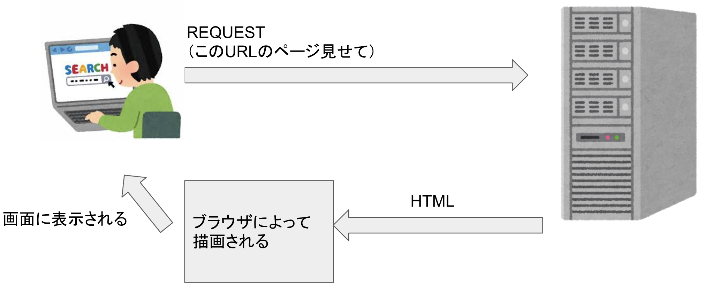
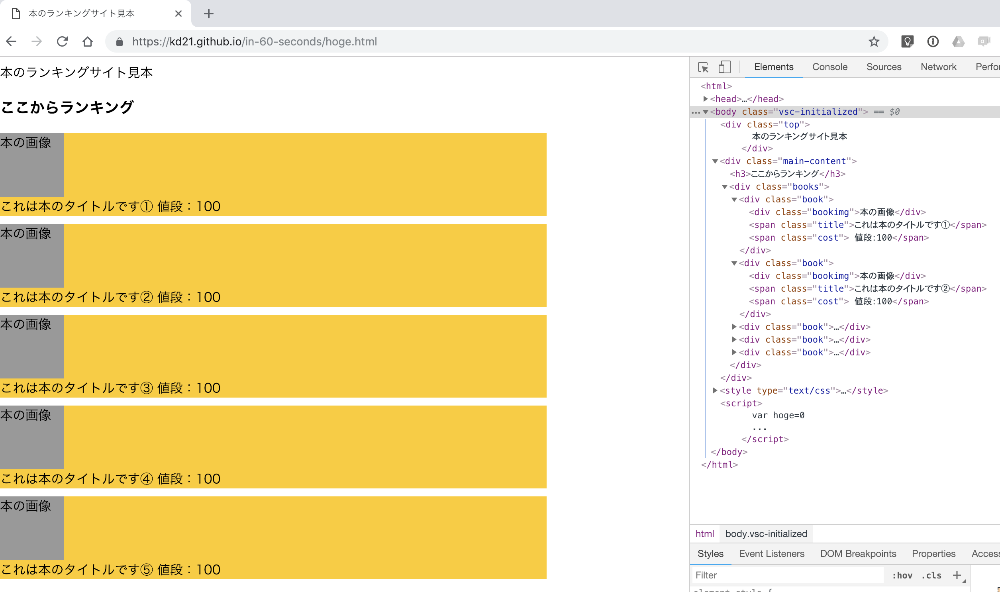
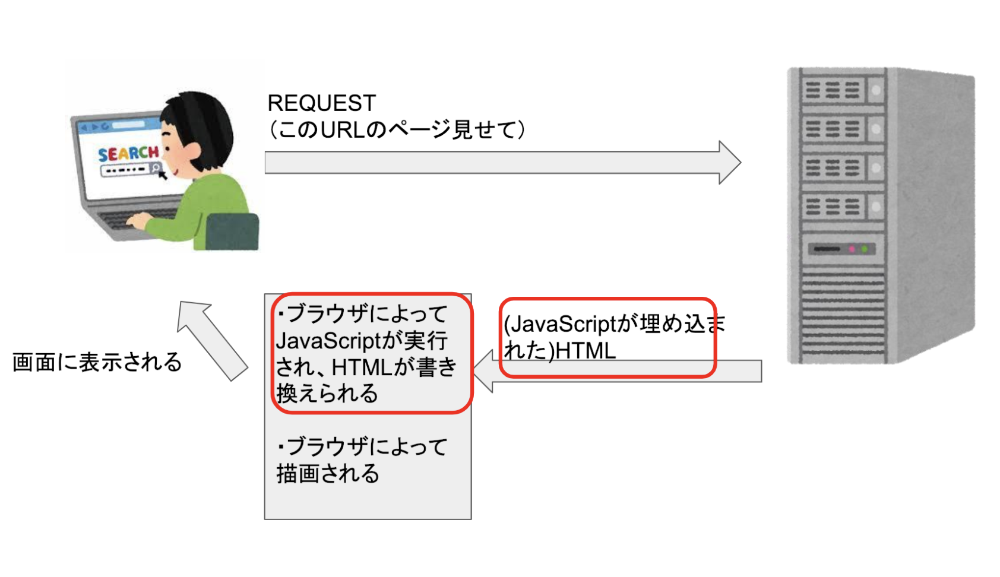
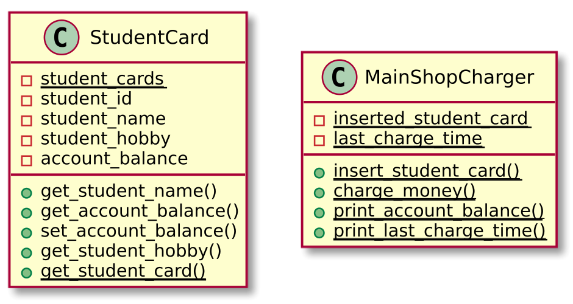
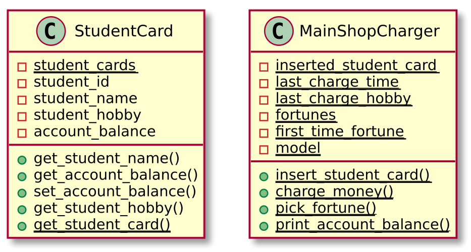
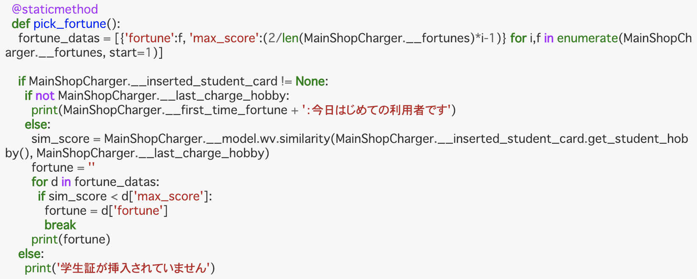
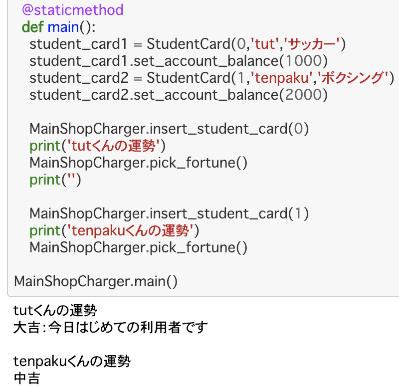
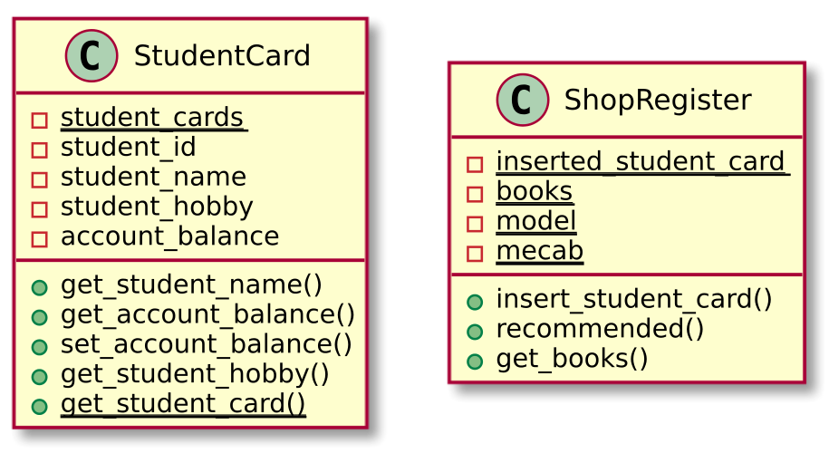
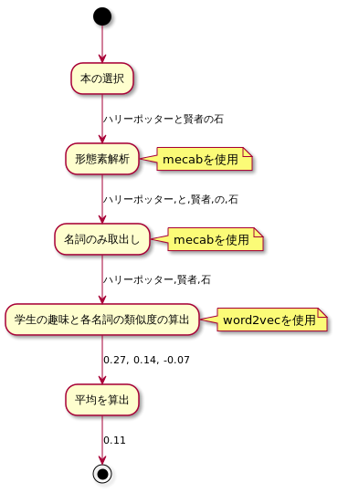
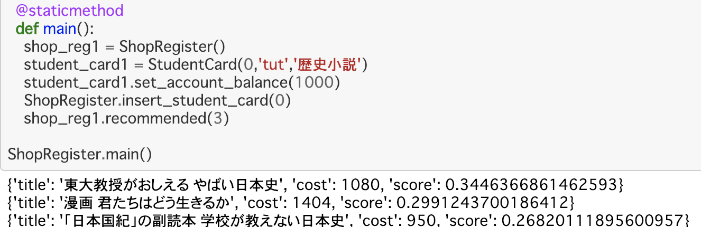

@snap[north-west]
#### **拡張の方向性、方法は自由！**
@snapend
@snap[west span-100]
@ul
- 今回<u>紹介するプログラム</u>の機能拡張をする
- GUIで操作できるようにする
- DBに対応する
- @color[orange](***データの取得方法を工夫する（Webスクレイピング）***)
- Web APIに対応する
- @color[orange](***形態素解析を用いた自然言語処理***)
- word2vecの学習モデルの精度や対応する単語を増やす
@ulend
@snapend

---
@snap[north-west]
#### **①静的サイトのWebスクレイピング**
ブラウザでサイトが開かれるまでの簡略図
@snapend
  

---
@snap[north-west]
#### **①HTMLの描画例 [@color[orange](@fa[desktop])](https://kd21.github.io/in-60-seconds/) [@color[orange](@fa[file-code-o])](https://github.com/kd21/in-60-seconds/tree/master/docs)**
@snapend

---?code=assets/src/static_website_scraping.py&lang=python
@snap[north-west]
#### **①pythonで静的なサイトのWebスクレイピング [@color[orange](@fa[file-code-o])](https://kd21.github.io/in-60-seconds/) **
@snapend
@[1-2](requestsとBeautifulSoupというライブラリを使います)
@[4](ここでスクレイピングしたいサイトのURLを書き込みます)
@[5-7](ここは特に書き換えなくても大丈夫です)
@[10](ここで、divタグ∧class名がrankInnerの中の、aタグのtextを取出しています)
---
@snap[north-west]
#### **②動的サイトのWebスクレイピング**
ブラウザでサイトが開かれるまでの簡略図
@snapend
  

---
@snap[north-west]
#### **②例のサイトが動的サイトの場合　[@color[orange](@fa[desktop])](https://kd21.github.io/in-60-seconds/) [@color[orange](@fa[file-code-o])](https://github.com/kd21/in-60-seconds/tree/master/docs)**
@snapend
<table border="0">
<tr>
<td></td>
<td>←</td>
<td></td>
</tr>
</table>

---?code=assets/src/dynamic_website_scraping.py&lang=python
@snap[north-west]
##### **②Pythonで動的なサイトのWebスクレイピング [@color[orange](@fa[file-code-o])](https://kd21.github.io/in-60-seconds/) **
@snapend
@[1-3](BeautifulSoupとseleniumというライブラリを使います)
@[5](ここでスクレイピングしたいサイトのURLを書き込みます)
@[6](webdriver（今回はPhantomJSを使用）を起動しています)
@[7-8](URLを指定して、3秒待っています（JavaScriptが実行され、HTMLが書き終えるのを待っています）)
@[9](JavaScriptが実行し終わり、書き終えたHTMLを取得します)
@[11](divタグ∧a-fixed-left-grid-colというクラスの中の divタグ∧p13n-sc-truncatedのテキストを全て取出しています)

---?code=assets/src/mecab_example.py&lang=python
@snap[north-west]
##### **③形態素解析 [@color[orange](@fa[file-code-o])](https://kd21.github.io/in-60-seconds/) **
@snapend
@[1-2](Mecabというライブラリを使います)
@[4](tokenized_textにテキストをトークン化した結果が文字列で保存されます（どのような文字列で保存されるか気になる人はtokenized_textをprintしてみてください）)
@[5](トークン化した文字列をsurfacesリストに追加します)
@[6](それぞれのトークンの品詞をpostsリストに追加します)
@[7-15](morphsリストにトークン化した文字列とその品詞を保存します)

---
@snap[north-west]
##### **現状のクラス [@color[orange](@fa[file-code-o])](https://kd21.github.io/in-60-seconds/) **

@snapend

---
@snap[north-west]
##### **改良1：チャージ機におみくじ機能をつける [@color[orange](@fa[file-code-o])](https://kd21.github.io/in-60-seconds/) **
 
###### おみくじ機能の発行条件
@ul
- 直前にチャージした人の趣味と、チャージした人の趣味の距離によって、運勢を算出
- 一番最初にチャージした人は大吉
@ulend
@snapend

---
@snap[north-west]
##### **改良1：クラスの構成**

@snapend

---
@snap[north-west]
##### **改良1：実装（趣味の類似度算出部分）**
@snapend

---
@snap[north-west]
##### **改良1：実装結果**
@snapend

---
@snap[north-west]
##### **改良2：学生におすすめの本を表示する [@color[orange](@fa[file-code-o])](https://kd21.github.io/in-60-seconds/) **
 
##### おすすめの条件
学生の趣味と、販売されている本（100冊）のタイトルの全類似度を算出し、類似度TOP3を表示
@snapend

---
@snap[north-west]
##### **改良2：クラスの構成**
新たにShopRegisterというクラスを作成する

@snapend

---
@snap[north-west]
##### **改良2：趣味に近い本の算出方法**
@snapend
 

---
@snap[north-west]
##### **改良2：実装結果**
@snapend

---
@snap[north-west]
#### **付録一覧**
@snapend
@snap[west span-100]
@ul
- 静的Webサイトの例 [@color[orange](@fa[file-code-o])](https://kd21.github.io/in-60-seconds/) 
- 動的Webサイトの例 [@color[orange](@fa[file-code-o])](https://kd21.github.io/in-60-seconds/) 
- 静的サイトのスクレイピングプログラム [@color[orange](@fa[desktop])](https://kd21.github.io/in-60-seconds/) [@color[orange](@fa[file-code-o])](https://kd21.github.io/in-60-seconds/) 
- 動的サイトのスクレイピングプログラム [@color[orange](@fa[desktop])](https://kd21.github.io/in-60-seconds/) [@color[orange](@fa[file-code-o])](https://kd21.github.io/in-60-seconds/) 
- 形態素解析により、形態素に切り分け、品詞を特定するプログラム [@color[orange](@fa[file-code-o])](https://kd21.github.io/in-60-seconds/) 
- ベースとなる冬季課題1終了時点のプログラム例 [@color[orange](@fa[file-code-o])](https://kd21.github.io/in-60-seconds/)
- 改良1のプログラム [@color[orange](@fa[file-code-o])](https://kd21.github.io/in-60-seconds/) 
- 改良2のプログラム [@color[orange](@fa[file-code-o])](https://kd21.github.io/in-60-seconds/) 
@ulend
